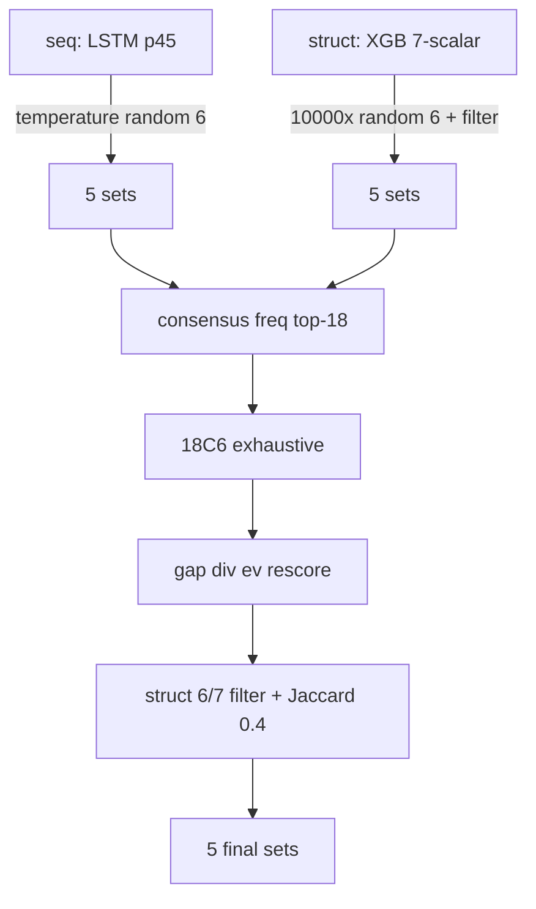

# 4군 랜덤 원인 정밀 정찰 보고서

**정찰일:** 2026-05-16  
**범위:** 코드 읽기 + DB 조회만 (수정·백테 실행 없음)  
**DB:** `d:\3kweon\data\lotto4.db`

---

## STEP 0 – 3파일 확인

- ✅ **RULES_FIXED.md** 확인 (R1~R30)
- ✅ **STATUS_LATEST.md** 확인 (기억73, 풀백 완주·결과 미흡)
- ✅ **CURSOR_RULES.md** 확인

---

## 1. seq_brain 학습 구조 분석 (`seq_brain.py`)

### 1-1. predict()와 fine-tune 관계

| 항목 | 코드 사실 |
|------|-----------|
| `predict()` 내부 | **`_finetune_before_predict()` 자동 호출** (L285) |
| `update_model()` | **별도 함수** — 당첨 확정 후 온라인 미세조정용 (L182), `predict()`에서 **직접 호출하지 않음** |
| 풀백 경로 | 백테스트 러너가 회차마다 `update_model`을 별도 호출할 수 있으나, **`predict()` 자체도 매번 fine-tune 수행** |

### 1-2. fine-tune 데이터·하이퍼파라미터

| 상수 | 값 | 의미 |
|------|-----|------|
| `WINDOW` | **50** | LSTM 입력 시퀀스 길이 (최근 50회차) |
| `FINETUNE_TAIL` | **100** | fine-tune에 쓰는 **윈도우 샘플 수** (최근 100개 `(X,y)` 쌍) |
| `EPOCHS_FINETUNE` | **5** | fine-tune epoch |
| `LR` | **0.001** | Adam learning rate |
| `EPOCHS_INITIAL` | 50 | 최초 `initial_train` epoch (모델 없을 때만) |
| `MIN_DRAW_NO` | 51 | draw 51 미만은 학습 표본에서 제외 |

**데이터 범위:** `load_draws_before(db, draw_no)` → `draw_no` **미만** 전체 이력 중, `_build_windows`로 `(윈도우 50 → 다음 회차)` 샘플 생성 후 **마지막 100개만** 사용.

### 1-3. 모델 저장 방식

- `_save_model()` → `models/seq_brain_latest.pt` **단일 파일 덮어쓰기** (L134~138)
- fine-tune 후 meta: `{"last_update_draw": draw_no, "finetune_loss": loss}` 또는 initial: `{"target_draw": ...}`

### 1-4. predict() 번호 선택 로직 (temperature 샘플링)

**흐름 요약:**

1. 모델 없음 / Torch 없음 / 윈도우 부족 → **`_predict_cpu_random_filtered()`** (순수 난수 + 필터)
2. 모델 로드 → **`_finetune_before_predict()`** (5 epoch 추가 학습)
3. 최근 50회차 벡터 → LSTM → **45차원 sigmoid 확률 `p`**
4. 세트별 temperature `TEMPS = (0.5, 0.7, 1.0, 1.2, 1.5)` 적용
5. **`_sample_combo()`**: temperature 정규화 후 **비복원 가중 랜덤 6개** 추출
6. `smart_filter_relaxed` + Jaccard≤0.5 중복 제거, 최대 500회 재시도
7. 부족 시 **`rng.sample(range(1,46), 6)`** 완전 난수 fallback (L327~331)

**핵심 함수 — `_sample_combo()` (L223~243):**

```python
def _sample_combo(prob45, rng):
    p = prob45.astype(np.float64).copy()
    picked = []
    for _ in range(6):
        p = p / p.sum()
        r = rng.random()
        # 누적확률로 1개 선택 → p[i]=0 (비복원)
        ...
    return sorted(picked)
```

**RNG 시드:** `random.Random(draw_no * 404_321 + 8181)` — 회차 고정이나 **본질은 확률적 샘플링**.

### 1-5. 핵심 질문: fine-tune이 이전 학습을 덮어쓰는가?

**→ 기존 가중치 위에 추가 학습 (incremental).**

- `_load_model()`로 **기존 `state_dict` 로드** (L141~155)
- `_finetune_before_predict()` / `update_model()` 모두 **같은 가중치에서 Adam 5 epoch** (L195~198, L210~211)
- **모델 초기화(reset) 없음** — 다만 **5 epoch × 100 sample**은 이전 50 epoch full train 대비 **강한 drift** 가능
- 저장은 **항상 단일 `.pt` 덮어쓰기** → 디스크상 이전 스냅샷 소멸

**랜덤 기여:** LSTM 출력 `p`가 **45개 독립 sigmoid** → 번호 간 상호배타 제약 없음 → temperature 후 **가중 랜덤 추출** → 확률이 평탄하면 **거의 uniform에 가까움**.

---

## 2. struct_brain 번호 생성 분석 (`struct_brain.py`)

### 2-1. XGBoost가 예측하는 7개 구조 변수

| # | 변수명 | 의미 (코드) |
|---|--------|-------------|
| 0 | `total_sum` | 6번호 합 (clip 21~255) |
| 1 | `odd_count` | 홀수 개수 (0~6) |
| 2 | `high_count` | 23 이상 개수 (0~6) |
| 3 | `ac_value` | AC값 (0~10) |
| 4 | `consec_count` | 연속 쌍 수 (0~5) |
| 5 | `decade_max` | 동일 10의 자리 최대 (1~5) |
| 6 | `tail_variety` | 끝자리 종류 수 (1~6) |

예측값 `y_hat`은 `_postprocess_y_hat()`으로 반올림·clip (L262~271).  
모델 없을 때 fallback: `[100, 3, 3, 7, 1, 3, 5]` (중심 구조).

### 2-2. 구조값 → 6번호 생성 함수

**핵심 경로:** `predict()` → `update_models()` → `_infer_y_hat()` → **`_pick_sets_from_y_hat(draw_no, y_hat)`**

**`_generate_candidates()` (L322~339):**

```python
for _ in range(RANDOM_TRIES):          # 10,000회
    cand = sorted(rng.sample(range(1, 46), 6))   # ← 완전 난수 6개
    act = struct_vector(cand)
    if _count_soft_match(act, y_hat) < 5:       # 7변수 중 5+ soft match
        continue
    d = _struct_distance(act, y_hat)
    cands.append((d, cand))
cands.sort(key=d) → 상위 TOP_K_CANDIDATES(400)
```

**`_pick_sets_from_y_hat()` (L349~389):**

- 후보 400개 중 **구조 거리 순** + Jaccard≤0.5 → **5세트**
- 후보 부족 시 5000회 추가 난수 시도 (soft match ≥4)
- 여전히 부족 → **`rng.sample` 완전 난수** (L385~387)

### 2-3. 랜덤 요소 위치

| 위치 | 방식 |
|------|------|
| `_generate_candidates` | **`rng.sample(range(1,46), 6)` × 10,000** |
| fallback pool | 추가 `rng2.sample` |
| 5세트 미달 | `r2.sample` 완전 난수 |
| `predict()` XGB 없음 | 순수 `rng.sample` × 5 (L395~396) |

**RNG 시드:** `draw_no * 131_101 + 77` (고정 재현성, 본질은 난수 탐색).

### 2-4. 후보 수·5세트 선택

- 생성: soft match ≥5인 조합 최대 **400개** (10,000 시도 중)
- 선택: 거리 오름차순 + **Jaccard 0.5** 다양성 → **5세트**
- 동일 구조에 맞는 조합은 **수천~수만 개** 존재 → **400개 중 임의 표본**

### 2-5. 핵심 질문: 구조 예측이 완벽해도 번호 선택은 랜덤인가?

**→ 예. 구조 예측은 “필터/거리”만 제공하고, 번호 자체는 난수 샘플링.**

- XGB는 **7개 스칼라**만 예측 — **개별 번호(1~45) 확률을 내지 않음**
- 번호 생성 = **Monte Carlo 난수 + 구조 soft match** (7개 중 5개 이상 허용 `TOLS`)
- 구조가 맞는 조합 공간이 넓어 **동일 y_hat에도 수많은 6조합** → 최종 5세트는 **탐색 결과의 우연**

---

## 3. ensemble Commander 분석 (`ensemble.py`)

### 3-1. 에이스 후보 세트 수

```python
seq_sets = seq_brain.predict(...)      # 5세트
struct_sets = struct_brain.predict(...) # 5세트
chief_sets = seq + struct (중복 제거)   # 최대 10세트
```

**각 5세트, 합치면 최대 10세트** (동일 조합 시 fewer).

### 3-2. 18번호 풀 추출

```python
c_seq = _counts_per_number(seq_sets)      # 각 번호 등장 횟수 (0~5)
c_struct = _counts_per_number(struct_sets)
consensus[n] = pw["v13_seq"]*c_seq[n] + pw["v13_struct"]*c_struct[n]
ranked_n = sorted(..., key=-consensus)    # 빈도·가중합 내림차순
pool18 = ranked_n[:18]                    # 상위 18번호
```

- **중복 번호는 빈도 합산** (2뇌 모두에 있으면 가중합 ↑)
- **18개 미만 고유번호**면 pool이 줄어듦 → 18C6 조합 수 감소
- **빈도순 top-18** — 에이스 10세트(최대 60번호 슬롯, unique ≤45)에서 **상대 빈도**만 반영

### 3-3. 18C6 조합 점수 (5요소)

`precompute_combo_scores()` — **18C6 = 18,564조합 전수**:

| 점수 | 계산 |
|------|------|
| **consensus** | `sum(consensus[n] for n in combo)` → min-max |
| **struct** | `_struct_soft_hits(c, y_hat) / 7.0` → min-max |
| **gap** | `gap_brain.gap_score_for_set(c, z)` → min-max |
| **div** | `diversity_score_for_set(c, chief_sets, recent)` → min-max |
| **ev** | `_batch_ev_scores` (birthday·연속·홀짝 등) → min-max |

**FINAL_SCORE** = 0.30·consensus + 0.30·struct + 0.10·gap + 0.20·div + 0.10·ev

### 3-4. consensus = 에이스 등장 횟수?

**→ 예, 가중 등장 빈도.**

- seq 세트 5개 + struct 세트 5개에서 각 번호 **등장 횟수** (0~5)
- evolution 동적 가중치 `pw["v13_seq"]`, `pw["v13_struct"]`로 **선형 결합**
- combo 점수 = pool18 내 6번호의 consensus 값 **합**

### 3-5. 최종 5세트: 구조 필터 + Jaccard

`pick_with_final_weights()` → `_greedy_pick()`:

1. FINAL_SCORE 내림차순 **상위 500** (`TOP_CANDIDATES`)
2. **struct_hits ≥ 6** → 부족 시 **≥5** → **≥4** (단계적 완화)
3. 이미 고른 세트와 **Jaccard ≥ 0.4** 이면 스킵 (`JACCARD_LIMIT = 0.4`)
4. 5세트 못 채우면 구조 필터 없이 Jaccard만 적용 fallback

### 3-6. 핵심 질문: 에이스 10세트가 랜덤이면 Commander도 랜덤인가?

**→ 구조적으로 그렇다 (cascade).**

```
seq(확률샘플링) + struct(난수+구조필터)
    ↓ 빈도 top-18
18C6 전수 + 리스코어 (gap/div/ev는 번호 패턴 휴리스틱)
    ↓
최종 5세트
```

- pool18은 **에이스 난수/샘플의 빈도 파생** — 신호가 약하면 **45번호 중 우연적 18개**
- 18C6 최적화는 **주어진 18개 안에서만** — **당첨 6개가 pool 밖**이면 **구조적으로 0~2 적중 상한**
- gap/div/ev는 **과거 통계 휴리스틱** — 예측력이 아닌 **리스크·다양성 조정**
- Commander는 **“에이스 품질을 재조합·필터”**할 뿐, **새 정보(번호 확률)를 생성하지 않음**

---

## 4. DB 적중 패턴 (조사 4)

> `lotto_predictions_army4`는 **`target_draw_no`** 컬럼 사용 (지시 SQL의 `draw_no`와 동일 의미).

### 4-1. 에이스 vs 서브 (draw_no ≥ 600)

| brain_tag | avg_mc | hits_3+ | hits_4+ | total |
|-----------|--------|---------|---------|-------|
| v13_diversity | **0.8109** | 81 | 4 | 3120 |
| v13_ev | 0.8016 | 62 | 4 | 3120 |
| v13_evolution | 0.8013 | 73 | 3 | 3120 |
| v13_gap | 0.7862 | 72 | **5** | 3120 |
| **v13_seq** | 0.7798 | 58 | 3 | 3120 |
| **v13_struct** | 0.7788 | 76 | 4 | 3120 |
| v13_ensemble | 0.7747 | 59 | 2 | 3120 |

**해석:** draw≥600 구간에서 **에이스(seq·struct)가 서브(diversity·ev)보다 avg 낮음**. Commander(ensemble) **최하위**. gap만 4+ 5건으로 에이스 struct(4건)와 비슷.

### 4-2. 에이스 번호 편향 (target_draw_no ≥ 900)

**기대 빈도:** 1,620세트 × 6 = 9,720 picks → 번호당 **≈216회** (uniform).

**v13_seq — 상위 10 / 하위 10**

| 상위 | freq | 하위 | freq |
|------|------|------|------|
| 12 | 272 | 5 | 114 |
| 6 | 271 | 20 | 153 |
| 45 | 265 | 25 | 159 |
| 13 | 265 | 43 | 159 |
| 7 | 264 | 44 | 179 |
| 38 | 254 | 26 | 185 |
| 21 | 250 | 27 | 185 |
| 16 | 250 | 18 | 189 |
| 35 | 248 | 17 | 191 |
| 33 | 240 | 30 | 191 |

**v13_struct — 상위 10 / 하위 10**

| 상위 | freq | 하위 | freq |
|------|------|------|------|
| 31 | 272 | 2 | 156 |
| 18 | 269 | 1 | 160 |
| 28 | 259 | 4 | 162 |
| 19 | 258 | 42 | 163 |
| 22 | 254 | 45 | 173 |
| 32 | 243 | 3 | 180 |
| 40 | 241 | 21 | 191 |
| 14 | 234 | 44 | 191 |
| 23 | 233 | 43 | 193 |
| 17 | 232 | 5 | 198 |

**편향:** seq **5번 114회(−47%)**, **12번 272회(+26%)**; struct **2번 156회(−28%)**, **31번 272회(+26%)**.  
uniform 대비 **체계적 편향 존재** — 다만 편향 방향이 seq/struct **서로 다름** (ace 간 합의 약함).

### 4-3. v13_seq 학습 효과 추세 (draw 1100~1223, 124회차)

| 지표 | 값 |
|------|-----|
| 회차당 **최대** matched_count 평균 | **1.50** |
| 전반(1100~1161) 평균 | **1.56** |
| 후반(1162~1223) 평균 | **1.44** |
| 10회차 chunk avg | 1.2 → 1.7 → 1.7 → 1.9 → 1.2 → 1.7 → 1.8 → 1.0 → 1.4 → 1.5 → 1.2 → 1.7 → 1.5 |

**판정: 평탄~미약 하락.** 최근 123회에서 적중 **상승 추세 없음**. fine-tune 100회마다 반복해도 **체감 학습 효과 미관측**.

### 4-4. ensemble 3+ 적중 (draw ≥ 900)

- **43건** (5세트×323회 ≈ 1,615세트 중 **2.7%**)
- **4적중 1건:** draw **930**
- 나머지 **42건은 3적중** — draw 906, 913, 915, 930, 981, 1011, … 1216 등 **산발적**, 주기 없음
- 동일 draw에 3+ **복수 세트** (예: 1110×4, 1203×2) — pool 품질 좋은 날 **우연 일치**

---

## 5. 종합 진단 — 랜덤에 가까운 근본 원인 (1~3순위)

### 🥇 1순위: **에이스 뇌의 번호 생성이 본질적으로 확률적(랜덤) 샘플링**

| 뇌 | 메커니즘 | 결과 |
|----|----------|------|
| **seq** | 45-dim sigmoid → temperature → **비복원 가중 랜덤 6개** | 번호 간 제약·共출현 모델링 없음, flat `p`면 uniform |
| **struct** | XGB **7스칼라** → **10,000× `sample(1..45,6)`** + soft filter | 개별 번호 예측 없음, 구조 맞는 조합 공간에서 **Monte Carlo** |

→ Commander·서브뇌는 **이미 랜덤에 가까운 10세트**를 입력으로 받음.

### 🥈 2순위: **Commander는 18번호 풀 안에서만 재조합 (정보 증폭 없음)**

- pool18 = 에이스 빈도 top-18 → **신호 약하면 우연 18개**
- 18C6 + gap/div/ev는 **휴리스틱 리스코어** — 당첨 번호 **예측이 아님**
- DB: draw≥600 **ensemble avg 0.7747 = 에이스보다 낮음** → Commander가 **개선 rather than amplify 실패**

### 🥉 3순위: **온라인 학습이 예측 품질을 끌어올리지 못함**

- seq fine-tune: 기존 weight + **5 epoch × 100 sample**, 매 predict마다 실행 → **catastrophic drift 가능**하나 **성능 상승 없음**
- struct `update_models`: **500회차 tail 재학습·덮어쓰기** — draw 151~339 **.json 잔존 에러** 구간은 **폴백/오염**
- 진화뇌 trust **0.50/0.50 고정** → ace 가중치 **동적 조정 미작동**
- seq draw≥1100 추세 **1.56→1.44 하락** → **학습 효과 미입증**

---

## 부록: 파이프라인 요약도



---

## 1~3군 간섭

**0건** (코드·DB 읽기만, 수정·실행 없음)

---

## 저장 체크리스트

- [x] 보고서 저장 (`d:\3kweon\reports\20260516_4군_랜덤원인_정밀정찰_보고서.md`)
- [x] STATUS_LATEST 갱신
- [x] Drive `커서보고서` 복사
- [x] 1~3군 간섭: 0건
